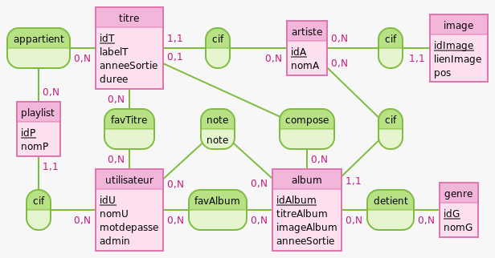

# SAE_PHP_MUSICS

## Attendus initiaux du projet

Réaliser une application web avec PHP permettant la gestion et l'affichage d'albums et d'artistes. L'application permettra notamment d'effectuer différentes opérations ( CRUD ) et permettra à des utilisateurs de se connecter, de liker des albums, ....

Voir sujet de la SAE pour plus de détails.

## Membres du groupe 

- Kylian Riberou
- Marin Tremine 
- Julien Rosse

## Lancer le projet

### Configurer la base de données

Un fichier SQLite `app.db` étant déjà présent avec des données pour le projet, il n'est pas obligatoire d'utiliser les commandes suivantes.

Cependant, si vous souhaiteriez partir d'une base de données vide pour charger vos propres données ( ou que le fichier app.db serait manquant ), voici comment initialiser la base de données.

Se rendre dans le dossier `app`.

Pour créer la base de données : 
```bash
php cli/sqlite.php create-database
```

Pour supprimer la base de données :
```bash
php cli/sqlite.php delete-database
```

Pour créer les tables : 
```bash
php cli/sqlite.php create-tables
```

Pour supprimer les tables : 
```bash
php cli/sqlite.php drop-tables
```

### Lancer l'application

Dans le dossier `app`

```bash
php -S localhost:8000
```
## Modèle Conceptuel de Données



Schéma représentant la base de données utilisée pour cette SAE. 

## Fonctionnalités implémentées

Toutes les fonctionnalités attendues ont été implémentées.

Un panel administrateur fournissant un CRUD pour les albums, artistes, genres et utilisateurs est à disposition.

Un visiteur peut créer un compte ou se connecter. Cela lui permet de liker des albums, de les noter, et de créer des playlists qu'il peut personnaliser et retrouver.

Des titres ont été rajoutés aux albums. Un utilisateur peut donc aussi effectuer des recherches sur des titres, mais aussi les écouter grâce au lecteur vidéo implémenté.

Il est donc possible pour un utilisateur d'écouter des albums ou des playlists qu'il a composé.

## Contraintes

Le projet respecte les contraintes imposées par le sujet. Le code est organisé dans une arborescence cohérente, utilisant les namespaces et un autoloader, mais aussi un controleur frontal.

Un provider pour charger le fichier YAML est à disposition, qui permettra au besoin d'insérer des fichiers de données dans la base de données SQLite gérée avec PDO.

## Documentations

Diagramme de classes du modèle. Pas de relations directes entre les classes car la majorité des méthodes sont statiques.
Schéma trop volumineux pour être placé içi. Les diagrammes sont dans le dossier `diagrams/classes`.

diagramme d'activité et de séquence .....
TODO


## Conclusion

Le sujet de SAE étant plutôt court mais inspirant, nous avons apprécié réaliser ce projet et ajouter des fonctionnalités supplémentaires.

Cette SAE nous a permis de mettre à l'oeuvre et de solidifier les compétences obtenues dans le module **R4.10 Complément Web**, mais aussi les compétences nécéssaires au travail en groupe, avec un dossier git organisé et cohérent.

De plus, nous avons pu découvrir et utiliser des frameworks et librairies pour le côté client, tels que HTMX et TailWindCSS.
Ces technologies apprises nous ont permis de mieux organiser notre code et de faciliter l'utilisation de techniques JavaScript ( requêtes Ajax ).
