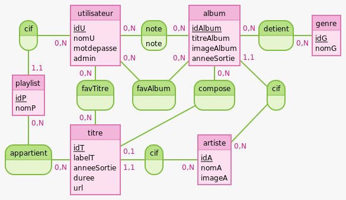

# SAE_PHP_MUSICS


lien github du projet : https://github.com/KylianRIBEROU/sae_php_music

## Attendus initiaux du projet

Réaliser une application web avec PHP permettant la gestion et l'affichage d'albums et d'artistes. L'application permettra notamment d'effectuer différentes opérations ( CRUD ) et permettra à des utilisateurs de se connecter, de liker des albums, ....

Voir sujet de la SAE pour plus de détails.

## Membres du groupe 

- Kylian Riberou
- Marin Tremine 
- Julien Rosse

## Lancer le projet

### Configurer la base de données

Un fichier SQLite `app.db` étant déjà présent avec des données pour le projet, il n'est pas obligatoire d'utiliser les commandes suivantes. Nous vous recommandons de lancer le projet avec le fichier déjà existant pour avoir assez de données et pour pouvoir lire des titres.

Cependant, si vous souhaiteriez partir d'une base de données vide pour charger vos propres données ( ou que le fichier app.db serait manquant ), voici comment initialiser la base de données.

Se rendre dans le dossier `app`.

Pour créer la base de données : 
```bash
php cli/sqlite.php create-database
```

Pour supprimer la base de données :
```bash
php cli/sqlite.php delete-database
```

Pour créer les tables : 
```bash
php cli/sqlite.php create-tables
```

Pour supprimer les tables : 
```bash
php cli/sqlite.php drop-tables
```

Pour charger un fichier de données YAML :
```
php cli/sqlite.php import-yml [nom_fichier]
```
### Lancer l'application

> Le lecteur de musique ne fonctionnant pas sur les navigateurs Chromium, nous conseillons d'ouvrir le site sur Mozilla Firefox pour une expérience complète.

Dans le dossier `app`

```bash
php -S localhost:8000
```

Un compte administrateur est à disposition pour avoir accès à toutes les fonctionnalités et au panel admin.

 Pseudo : **dalaigre**, Mot de passe : **dalaigre**

## Modèle Conceptuel de Données



Schéma représentant la base de données utilisée pour cette SAE. 

## Fonctionnalités implémentées

Toutes les fonctionnalités attendues ont été implémentées.

Un panel administrateur fournissant un CRUD pour les albums, artistes, genres et utilisateurs est à disposition.

Un visiteur peut créer un compte, modifier son profil et se connecter. 
Consulter les titres likés, ses playlists et les albums likés.
Il peut liker des albums et les noter.
Mais aussi liker des titres.
Il a la possibilité de créer, éditer, supprimer des playlists et y ajouter/suprrimer des titres.

Pour la recherche, on peut rechercher des albums, des artistes et des titres. Les critères de recherches sont les genres/le nom de l'album/de l'artiste ou l'année de parution de l'album. On sous entend qu'un titre et un artiste héritent des genres des albums liées. Après que la recherche est effectués, on laisse la possibilité à l'utilisateur de filtrer sa recherche pour avoir uniquement soit des albums, des artistes, ou des titres.

On peut aussi jouer / écouter de la musique avec le lecteur. Le lecteur peut prendre une liste de musique (track list) tels que des albums ou des playlists ou bien une seul musique.

Le lecteur permet de mettre en pause ou jouer la musique courante, gérer l'avancement du son, jouer la musique précedente et suivante, jouer une musique aléatoirement dans la liste des titres et revenir au début de la musique, choisir le volume de la musique ou le couper.


## Difficultés rencontrées

Lors de la lecture du sujet, nous avons directement voulu rajouter un player pour jouer les musiques. Cette fonctionnalité, nous a ajouté une difficulté technique, car nous voulions naviguer sur le site sans que le lecteur de musique se coupe. Nous avons donc du utiliser de l'AJAX pour effectuer des requêtes au serveur web pour modifier partiellement la page web. Nous avons choisi la librairie htmx pour palier à ce problème.

Nous avons rencontré une deuxième difficulté liée au lecteur car nous voulions que quand l'utilisateur recharge la page, le lecteur reste sur la musique courante, avec la même liste de sons et à la même durée de la musique. Pour ce faire, nous avons decidé de stocker ces informations dans les cookies coté serveur par une petite api sur notre serveur web qui communique avec le lecteur client front par du js avec fetch. 

Nous avons choisi de stocker ces cookies coté serveur avec $_SESSION et non coté client avec par exemple local storage en js car cela nous facilitait la tache pour envoyer au lecteur les demandes d'écoutes de musique(s).

Une autre difficulté rencontrée par l'ajax était de devoir rafraichir certaines parties de notre client lors de certaines actions utilisateurs. 

Par exemple, l'utilisateur like un album. On doit à la fois rafraichir le fait que l'album soit liké, dans le bloc de recherche, mais aussi afficher l'album dans le navigateur et le rafraichir car il affiche tous les albums likés par l'utilisateur.

Devoir parser les samples de données sans utiliser de parser Yaml ( indisponibles sur les machines de l'université ) existant à aussi été contraignant.

## Contraintes

Le projet respecte les contraintes imposées par le sujet. Le code est organisé dans une arborescence cohérente, utilisant les namespaces et un autoloader, mais aussi un controleur frontal. Pour le controleur frontal, nous avons du le modifier pour qu'il fonctionne avec la librairie htmx pour gérer les requêtes asynchrones.

Un provider pour charger le fichier YAML est à disposition, qui permettra au besoin d'insérer des fichiers de données dans la base de données SQLite gérée avec PDO.


## Documentations

Diagramme de classes du modèle. Pas de relations directes entre les classes car la majorité des méthodes sont statiques.
Schéma trop volumineux pour être placé içi. Les diagrammes sont dans le dossier `diagrams/classes`.

## Conclusion

Le sujet de SAE étant plutôt court mais inspirant, nous avons apprécié réaliser ce projet et ajouter des fonctionnalités supplémentaires.

Cette SAE nous a permis de mettre à l'oeuvre et de solidifier les compétences obtenues dans le module **R4.10 Complément Web**, mais aussi les compétences nécéssaires au travail en groupe, avec un dossier git organisé et cohérent.

De plus, nous avons pu découvrir et utiliser des frameworks et librairies pour le côté client, tels que HTMX et TailWindCSS.
Ces technologies apprises nous ont permis de mieux organiser notre code et de faciliter l'utilisation de techniques JavaScript ( requêtes Ajax, promesses, callbacks, fetch, API DOM ).
